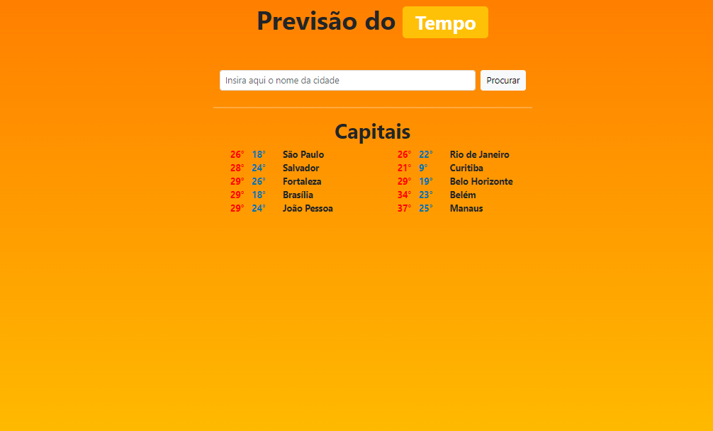
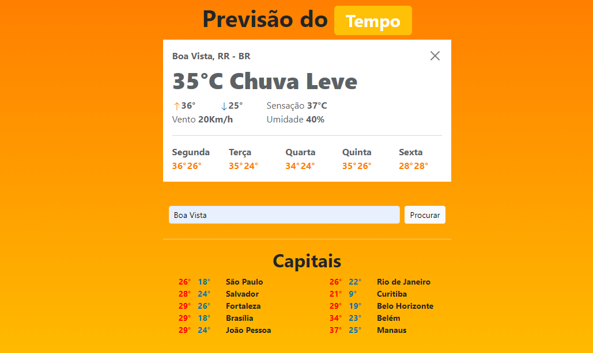
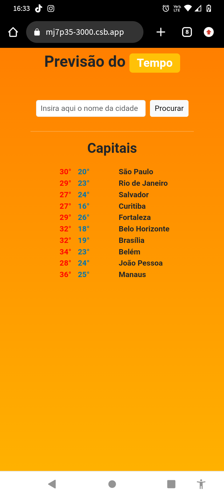
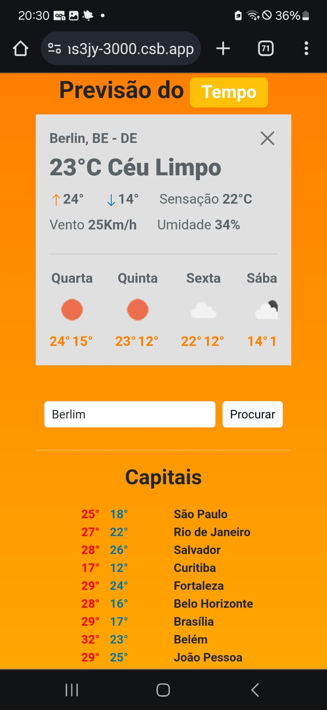

## RightTime (TempoCerto)
- Destinado a pessoas que queiram saber o clima de qualquer região
- Utiliza API [OpenWeathermap](https://openweathermap.org/) que tem dados de clima de qualquer região
- Feito com React Native, em conjunto do NodeJS no backend
- Compativel com sistemas mobile (responsivo)
- Demostrativo em tempo real, clique [aqui](https://khs3jy-3000.csb.app/). Ou veja no [codesandbox](https://codesandbox.io/p/devtool/preview/leandro305/TempoCerto/draft/condescending-austin?task=start&port=3000&redirect=true&utm_source=gh_app)

## Situação
- Desenvolvimento 04/11/2023
- Finalizado 10/11/2023

## Template Principal

## Mobile (Responsivo)

## Contato:
| Integrante | Usuário Git | E-mail para contato |
| --- | --- | --- |
| Leandro Lobo | [@LeandroLobo](https://github.com/bigolho16) | bigolho900@gmail.com |
