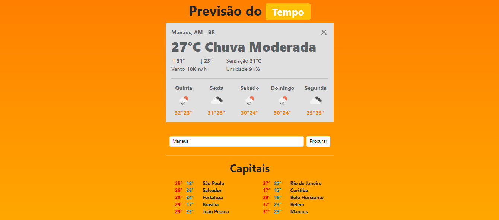

## RightTime (TempoCerto)
- Destinado a pessoas que queiram saber o clima de qualquer região
- Utiliza API [OpenWeathermap](https://openweathermap.org/) que tem dados de clima de qualquer região
- Feito com React Native, em conjunto do NodeJS no backend
- Compativel com sistemas mobile (responsivo)

## Situação
- Development 04/11/2023

## Template Principal

## Mobile (Responsivo)

## Contato:
| Integrante | Usuário Git | E-mail para contato |
| --- | --- | --- |
| Leandro Lobo | [@LeandroLobo](https://github.com/bigolho16) | bigolho900@gmail.com |
